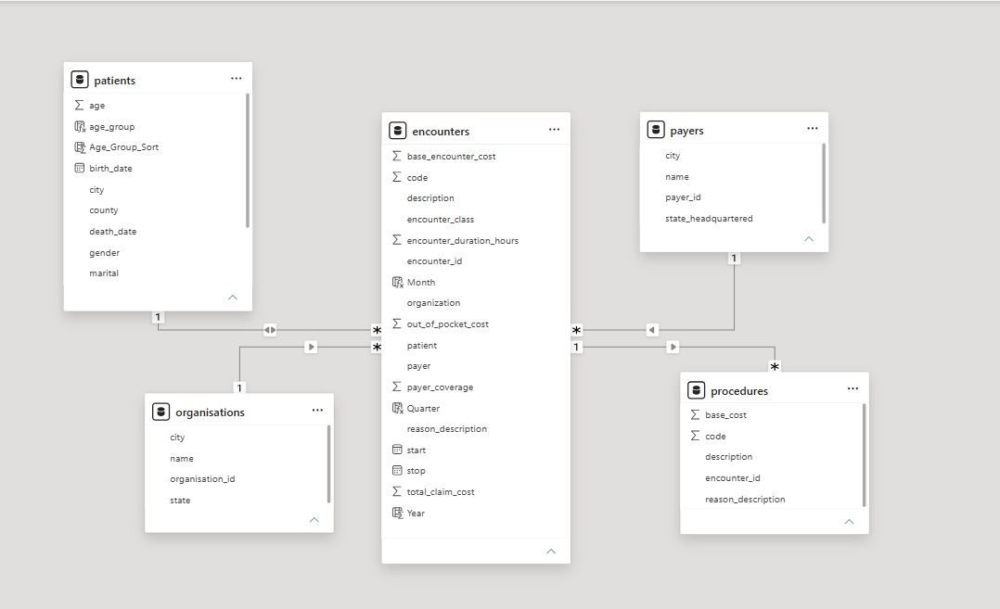
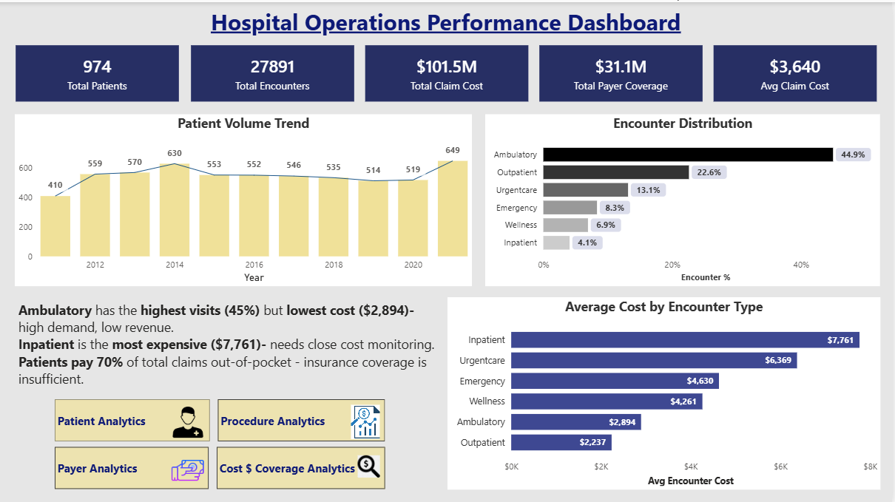
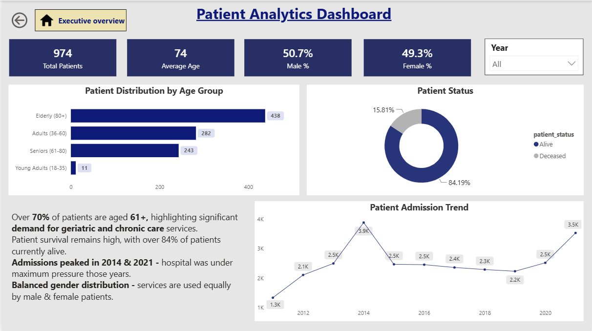
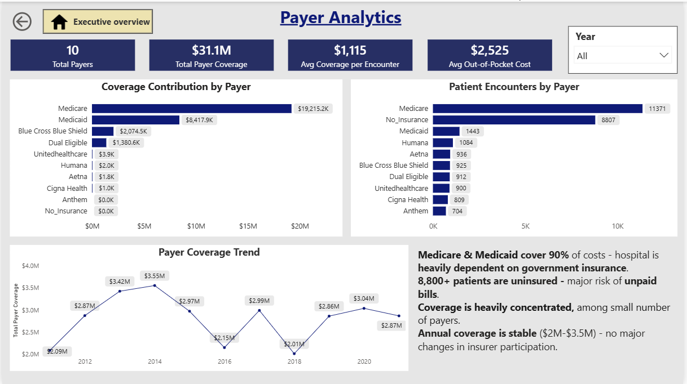
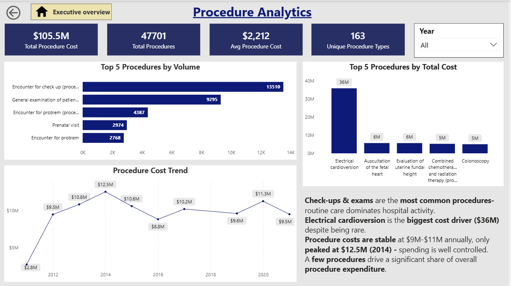
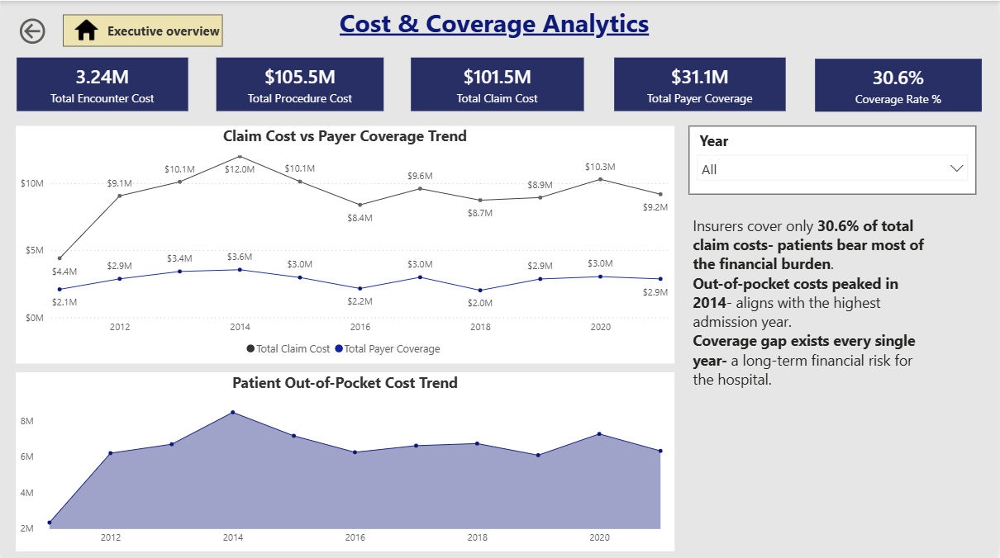

# hospital-analysis-powerquery-sql-powerbi

# 1. Hospital Operations Analytics Project | SQL, Power Query & Power BI
Hospital organizations generate large volumes of operational and financial data that are often difficult to analyze effectively. This project delivers an end-to-end analysis solution built using Power Query, MySQL and Power BI- enabling stakeholders to monitor patient trends, payer contributions, procedure costs and healthcare coverage through a centralized and dynamic reporting environment.

# 2. Tech stack:
- Power BI Desktop- Dashboard & Reporting
- Power Query- Data Cleaning & Transformation  
- MySQL- Data Extraction & Analysis
- DAX- Calculated Measures & KPIs
- Data Modeling- Star Schema (5 Tables)

# 3. Data source
Source- Maven Analytics
Dataset: Hospital & Patient Records
Data covers 974 patients including details on encounters, procedures, payers & organisations across multiple years from      2011 to 2022.

Tables Used:
patients — Patient demographics and status
encounters — Visit records and encounter types
procedures — Medical procedures and costs
payers — Insurance provider details
organisations — Hospital organisation data

# 4. Data Cleaning- Power Query
- Removed null and duplicate values
- Applied Trim and Clean transformations to improve text quality
- Standardized date formats across all tables
- Created out-of-pocket cost metric (Claim Cost − Payer Coverage)
- Calculated patient age from birth date
- Created age group categories (Young Adults, Adults, Seniors, Elderly)
- Removed irrelevant columns to optimize data model
- Prepared relationship keys and loaded cleaned tables into a star-schema model
- Ensured consistent data types across all columns

# 5. SQL Analysis — MySQL
Key analyses performed using SQL:
**Patient Admission Trends**- Used 'STR_TO_DATE()', 'YEAR()', 'COUNT()' and 'GROUP BY' to analyze annual encounter volumes.
**Encounter Class Distribution**- Applied window functions using 'SUM() OVER(PARTITION BY ...)' to calculate the percentage contribution of each encounter class by year.
**Encounter Duration Analysis**- Used 'TIMESTAMPDIFF()' and 'CASE WHEN' to classify encounters as over or under 24 hours and evaluate operational efficiency.
**Readmission Analysis**- Leveraged 'LAG()', 'DATEDIFF()', and CTEs to identify patients readmitted within 30 days and analyze readmission patterns.
**Payer Coverage Analysis**- Used filtering, aggregation, and percentage calculations to evaluate encounters with zero payer coverage and compare insurer contribution against claim costs.
**Procedure Utilization & Cost Analysis**- Applied 'COUNT()', 'AVG()', 'SUM()'

# 6. Data Model
A star-schema data model was developed to integrate patient, encounter, payer, procedure and organization data. This structure enabled efficient reporting, cross-functional analysis and optimized dashboard performance.

# 7. Dashboard Overview
## 📊 Dashboard Overview

### 1. Executive Overview

**Business Problem:** Hospital leadership requires a centralized view of operational and financial performance to monitor overall hospital health.
**Goal:** Provide a high-level summary of key performance indicators, encounter activity, patient volume and encounter costs.
**Visualizations Used:**
- KPI Cards- Total Patients, Encounters, Claim Cost, Payer Coverage, and Average Claim Cost
- Column & Line Combination Chart - Patient Volume Trend
- Horizontal Bar Chart - Encounter Distribution
- Horizontal Bar Chart - Average Cost by Encounter Type
  
KPI cards provide an instant overview of performance metrics. Bar charts enable quick comparison across encounter classes, while the trend chart highlights changes in patient volume over time.

**Key Insights:**
- Ambulatory encounters drive 45% of all activity but generate the lowest average cost ($2,894) - high volume, low revenue model.
- Inpatient encounters are the rarest but most expensive ($7,761 avg) even small increases in inpatient volume significantly impact costs.
- Total claim costs ($101.5M) far exceed total payer coverage ($31.1M) indicating a 69.4% coverage gap that patients must absorb.
- Patient volume peaked in 2021 - hospital should assess whether capacity and staffing were sufficient during that period.

### 2. Patient Analytics
**Business Problem:** Understanding patient demographics and admission behavior is critical for healthcare planning and resource allocation.
**Goal:** Analyze age distribution, gender composition, patient status and admission trends.
**Visualizations Used:**
* Horizontal Bar Chart - Age Group Distribution
* Donut Chart - Patient Status (Alive vs Deceased)
* Line Chart - Patient Admission Trend
* KPI Cards - Total Patients, Average Age, Male %, Female %

Bar charts improve readability when comparing demographic categories. Donut charts effectively display proportional distributions, while line charts are ideal for analyzing trends across time.

**Key Insights:**
- Over 70% of patients are aged 61+ - geriatric and chronic disease management should be the hospital's core service priority.
- Gender distribution is nearly equal (50.7% Male, 49.3% Female) no gender-based service gap exists in patient utilization.
- 84% of patients are currently alive - reflects strong clinical outcomes but the 15.81% deceased rate warrants mortality analysis.
- Admission peaks in 2014 and 2021 suggest seasonal or external demand surges - capacity planning is critical for such years.

### 3. Payer Analytics
**Business Problem:** Hospitals need visibility into insurance provider performance and coverage concentration.
**Goal:** Evaluate payer contribution, encounter volume, coverage trends and uninsured patient impact.
**Visualizations Used:**
- Horizontal Bar Chart - Coverage Contribution by Payer-
- Horizontal Bar Chart - Patient Encounters by Payer
- Line Chart - Payer Coverage Trend
- KPI Cards - Total Payers, Total Coverage, Average Coverage per Encounter, Average Out-of-Pocket Cost

Bar charts are highly effective for ranking payers and comparing contribution levels. Trend analysis helps assess coverage stability and reimbursement patterns over time.

**Key Insights:**
- Medicare and Medicaid contribute ~90% of total coverage heavy government dependency creates financial vulnerability 
  if policy or reimbursement rates change.
- 8,807 uninsured patient encounters recorded with near zero coverage - this represents a major bad debt and revenue loss risk.
- Coverage is concentrated among just 2-3 payers any disruption from these insurers would significantly impact hospital revenue.
- Annual payer coverage stable at $2M–$3.5M despite growing encounter volumes - coverage growth is not keeping pace with demand.

### 4. Procedure Analytics
**Business Problem:** Procedure utilization and expenditure significantly influence operational efficiency and healthcare costs.
**Goal:** Identify the most frequently performed procedures and the largest procedure cost drivers.
**Visualizations Used:**
- Horizontal Bar Chart - Top 5 Procedures by Volume
- Column Chart - Top 5 Procedures by Total Cost
- Line Chart - Procedure Cost Trend
- KPI Cards - Total Procedure Cost, Total Procedures, Average Procedure Cost, Unique Procedure Types

Horizontal bar charts are ideal for ranking procedures by frequency. Column charts emphasize cost comparisons, while trend charts reveal expenditure patterns over time.
**Key Insights:**
- Routine check-ups and general examinations dominate procedure volume - indicating the hospital primarily serves preventive 
  and outpatient care needs.
- Electrical cardioversion accounts for $36M in total cost despite low frequency - a single specialized procedure drives 
  disproportionate expenditure.
- Procedure costs peaked at $12.5M in 2014 and stabilized at $9M–$11M annually - suggesting improved cost control post-2014.
- Top 5 procedures by cost are all specialized or surgical - confirming that low-volume, high-complexity procedures are 
  the biggest financial drivers.

### 5. Cost & Coverage Analytics
**Business Problem:** Rising healthcare costs and insufficient insurance coverage can increase financial burden on both patients and providers.
**Goal:** Compare claim costs, payer coverage and patient out-of-pocket expenses to evaluate healthcare affordability.
**Visualizations Used:**
- Multi-Line Chart - Claim Cost vs Payer Coverage Trend
- Area Chart - Patient Out-of-Pocket Cost Trend
- KPI Cards - Total Encounter Cost, Total Procedure Cost, Total Claim Cost, Total Payer Coverage, Coverage Rate %

Line charts are best suited for comparing multiple financial trends over time. Area charts emphasize the magnitude of patient financial burden, while KPI cards summarize key financial indicators.
**Key Insights:**
- Insurers cover only 30.6% of total claim costs - patients bear nearly 70% of the financial burden, raising serious 
  healthcare affordability concerns.
- Claim costs consistently exceeded payer coverage every single year - this is a structural gap, not a one-time anomaly.
- Patient out-of- pocket costs peaked at $8.5M in 2014 - directly aligning with the highest admission and procedure 
  cost year, confirming the financial pressure on patients.
- Despite stable coverage levels, the growing gap between claim costs and coverage signals an urgent need for better 
  insurance negotiation or policy advocacy.

 

8. # Project Outcome

Developed an end-to-end healthcare analytics solution that transformed raw operational data into actionable insights. The project enabled analysis of patient demographics, payer performance, procedure utilization, hospital costs, and coverage gaps through a centralized reporting environment.

# 9. Project Structure

hospital-analysis-powerquery-sql-powerbi/
│
├── 📊 hospital_analysis_project.pbix
├── 🗄️ hospital_analysis_project.sql
├── 🖼️ hospital_data_model.png
│
├── 📸 Screenshots/
│   ├── 1_Executive_Overview.png
│   ├── 2_Patient_Analytics.png
│   ├── 3_Payer_Analytics.png
│   ├── 4_Procedure_Analytics.png
│   └── 5_Cost_Coverage_Analytics.png
│
├── 📂 Data/
│   ├── encounters.csv
│   ├── patients.csv
│   ├── payers.csv
│   ├── procedures.csv
│   └── organizations.csv
│
└── 📄 README.md

# 10. View Dashboard
**Live Dashboard:** https://app.powerbi.com/groups/me/reports/b1a19621-3678-4468-91c8-00f692515cfc/5f1c40399b3d9002c8b5?experience=power-bi

# 11. About 
**LinkedIn:** [Adya Tiwari](https://www.linkedin.com/in/adyatiwariofficial)
